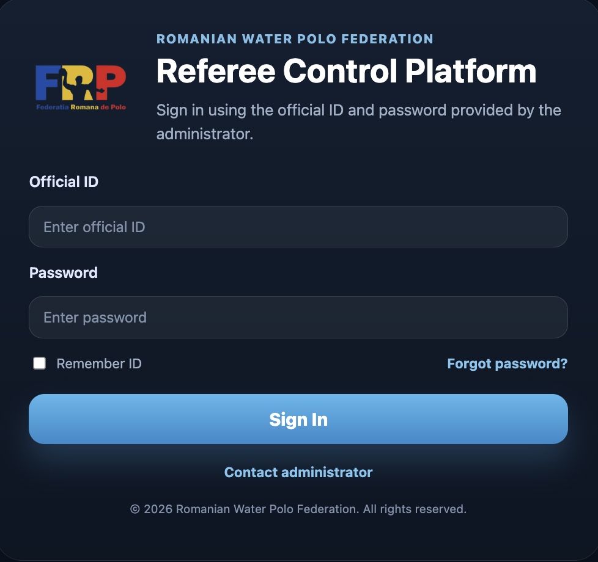
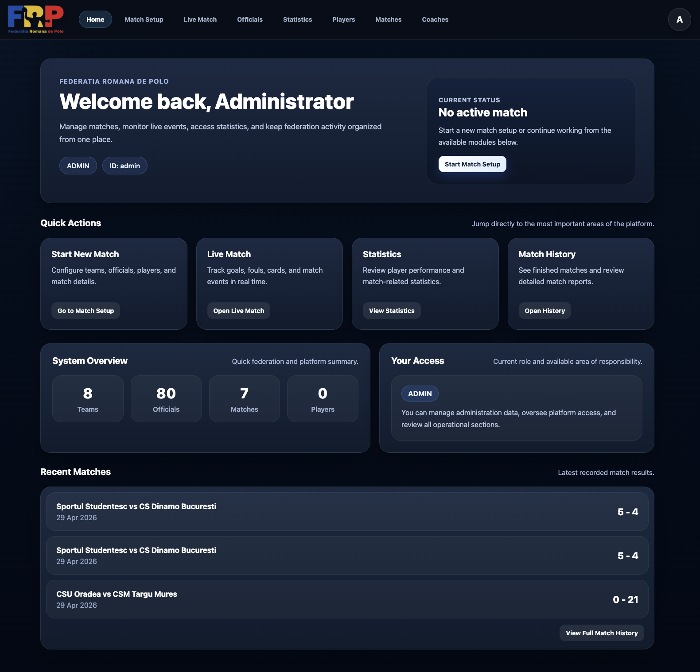
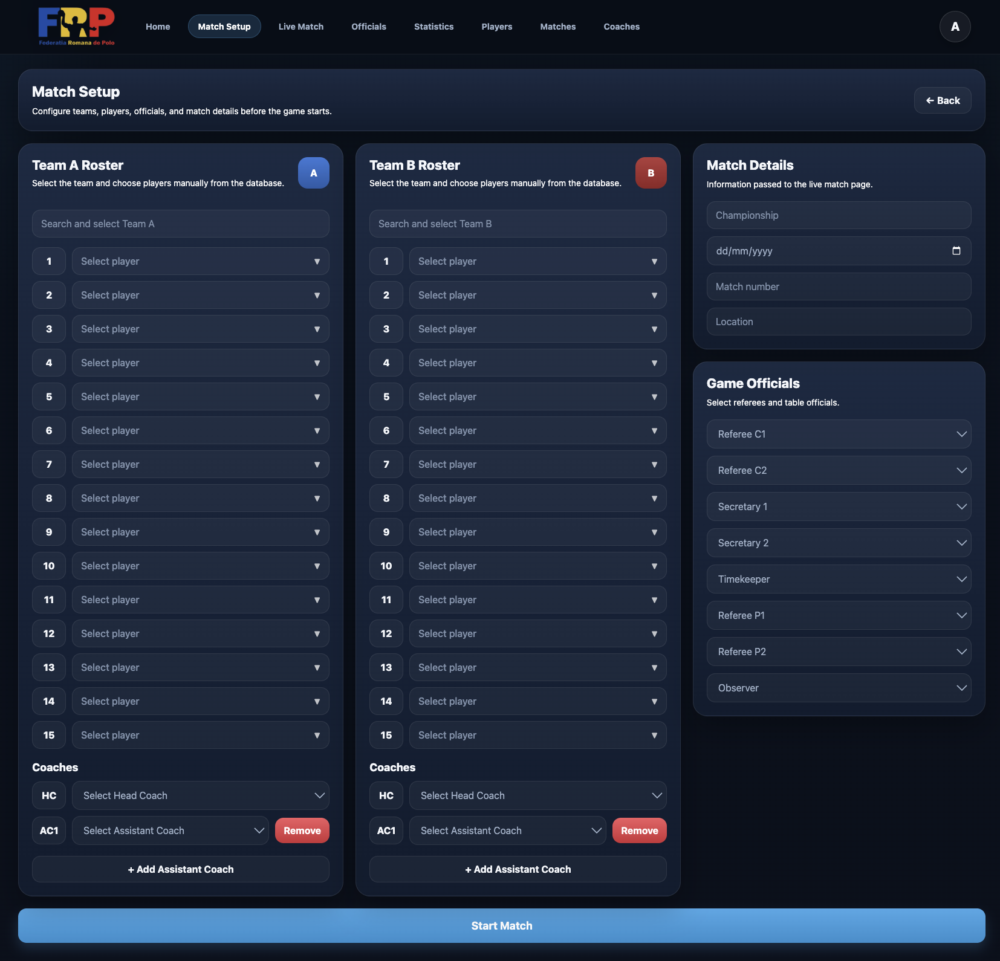
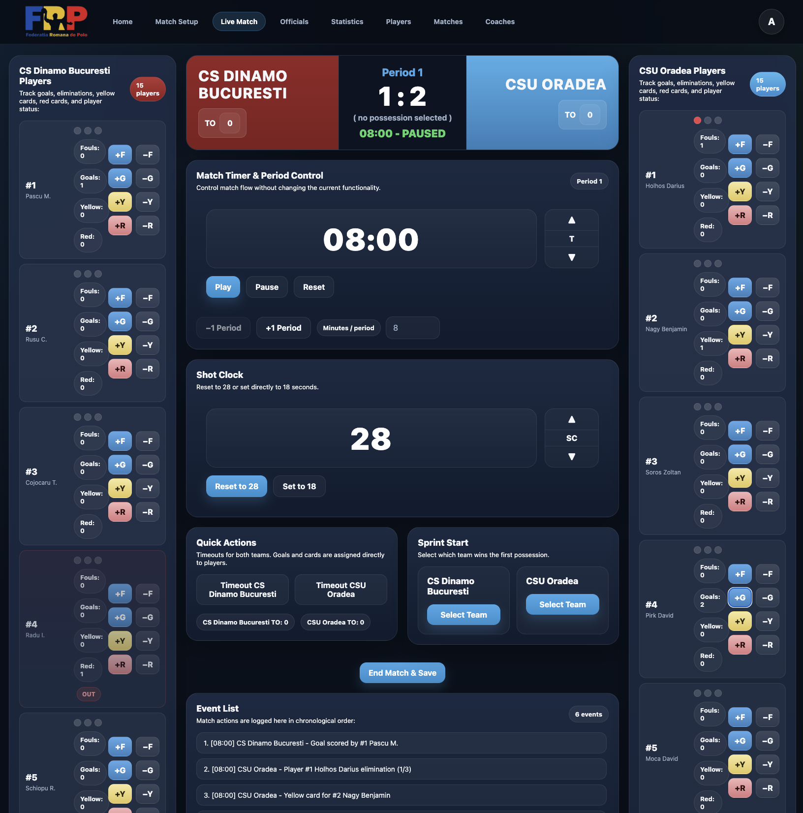

# Water Polo Referee System


A full-stack web application designed to support the management, monitoring, and administration of water polo matches.

The platform provides tools for referees, observers, and administrators to manage competitions, officiate live matches, record events, and analyze historical statistics through a centralized digital system.

---

## Features

### Authentication & Authorization

- Secure login system
- Session-based authentication
- Role-based access control:
  - **ADMIN**
  - **REFEREE**
  - **OBSERVER**

### Match Management

- Create and configure matches
- Assign teams and officials
- Store championship information
- Manage match location and scheduling
- Save complete match records

### Live Match Operations

- Run live match sessions
- Track score and game period
- Manage shot clock
- Record match events in real time
- Generate player statistics during gameplay

### Administration Module

- Manage referee accounts
- Manage observer accounts
- Control user permissions and access

### Team & Player Management

- Create, update, and delete teams
- Create, update, and delete players
- Manage coaches and team rosters
- Automatic player code generation

### Statistics & Match History

- Browse previously played matches
- Review detailed match information
- Access aggregated player statistics
- Filter data by player, team, or jersey number

---

## System Architecture

```text
Frontend (React + Vite)
        │
        ▼
REST API (Spring Boot)
        │
        ▼
     MySQL
```

---

## Tech Stack

| Layer | Technologies |
|---|---|
| Frontend | React, Vite, React Router DOM, CSS |
| Backend | Java 17, Spring Boot, Spring Web, Spring Security, Spring Data JPA |
| Database | MySQL |
| DevOps | Docker, Docker Compose |

---

## Screenshots

### Login Page

<p align="center">
  
</p>

### Home Page

<p align="center">
  
</p>

### Match Setup

<p align="center">
  
</p>

### Live Match

<p align="center">
  
</p>

---

## Running the Project

### Using Docker

```bash
docker compose up --build
```

The application starts:
- MySQL database
- Spring Boot backend
- React frontend

### Manual Setup

#### Backend

```bash
cd backend
mvn spring-boot:run
```

#### Frontend

```bash
cd frontend
npm install
npm run dev
```

---

## Project Structure

```bash
water-polo-referee-system/
│
├── backend/
│   ├── controller/
│   ├── service/
│   ├── repository/
│   ├── model/
│   ├── dto/
│   └── config/
│
├── frontend/
│   ├── src/
│   │   ├── pages/
│   │   ├── components/
│   │   ├── services/
│   │   └── styles/
│
├── docs/
│   └── screenshots/
│
├── docker-compose.yml
│
└── README.md
```

---

## Future Improvements

- Competition management module
- Observer evaluation reports
- Export statistics to PDF or Excel
- Responsive mobile interface
- Advanced analytics dashboard
- Cloud deployment

---
